# Shopy
IT IS A SHOP MANAGEMENT DESKTOP APPLICATION.

Developed a customized application for shop management. Motivation behind this application is to create an application which is very easy to use and understandable. Since many shopkeepers in rural areas are not very educated, so I have made this application for all such people.  I have created this application on demand of my brother. He is running a shop in our village. Like we have to do lots of calculation while making balance sheet/Bills for customers. And we have to do I repeatedly like for every customer we have to do at least twice in a month. It takes almost 2 days (working 15-20 hours) only for calculation and cross checking. He motivated me to do this, As sometime whenever I was at home I also have to help in that process. To reduce the effort, I have done this. This application successfully running from 01 January 2020 to onward. I have done trial for 2 months by myself to figure out bugs. And then I handover this application to my brother and I am working on it to improve some algorithms.
   
# Technology Used: 
 java

# Major Feature of this application

    • Graphical analysis of consumer, supplier, and shop
    • Easy to use and understand
    • Track of stock, consumer, and supplier status
    • Prints bills/mini slip    
    • Keeps the track of user account status
    • Automatically generate product order list (stock less than minimum required) for the shop
    • How is the profit in any intervals?
    • How is customer status while a period?
    • Book Orders in advanced
    • Available for both Hindi and English language
    

# Working Demo
<b>This is the first interface faced by the user(Login).<b/>
 

    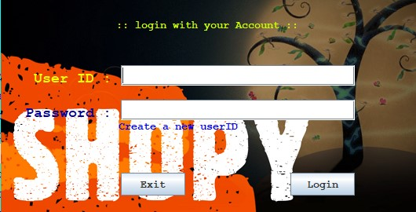 

 
<b>After valid id and password we move to the this interface. Here we can see that there are some analysis and conclusion about shop. </b>
 

     
    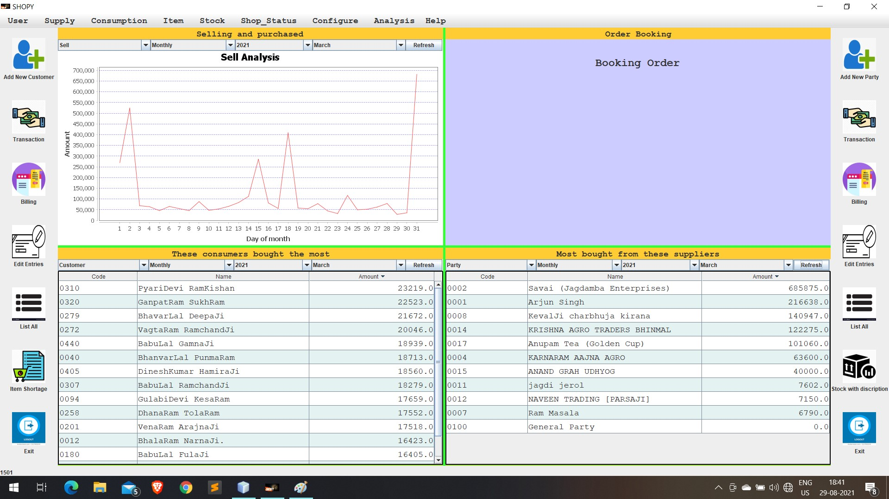 

 
 <b>If we go for transactions the we will be forwarded to this page. </b>
 

     
    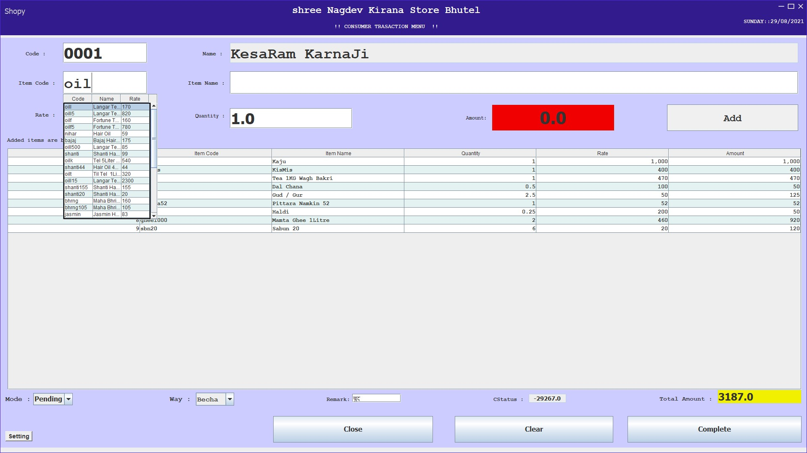 

 
<b>This kind of receipt will be printed if we want to print then make print on in setting of trasaction</b>
 

     
    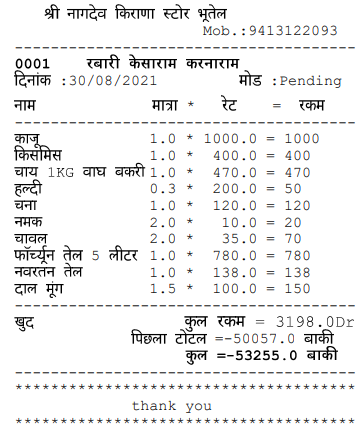 

 
<b>Add a consumer account:</b>
 

     
    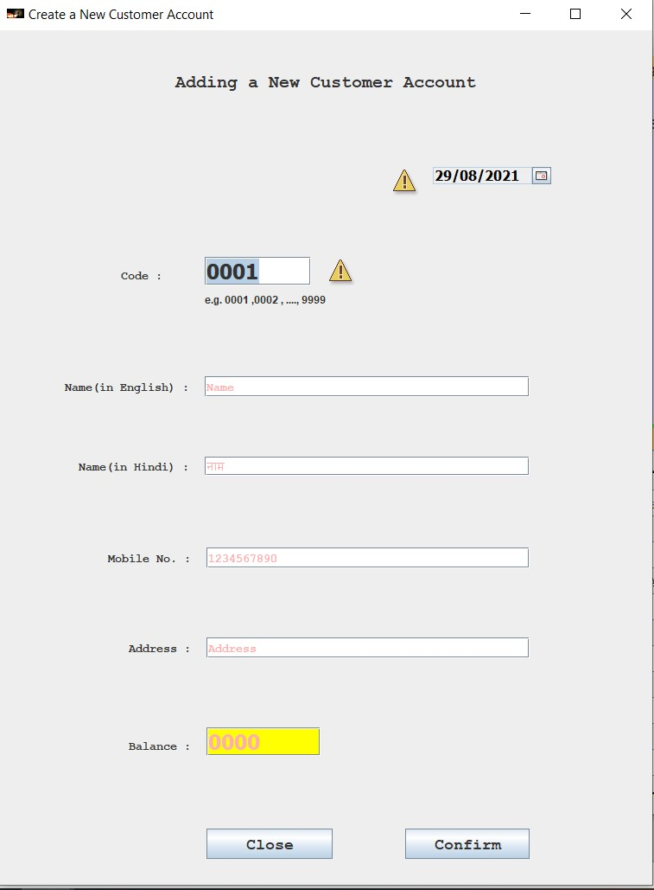 

 
<b>Billing for consumers:</b>
 

     
    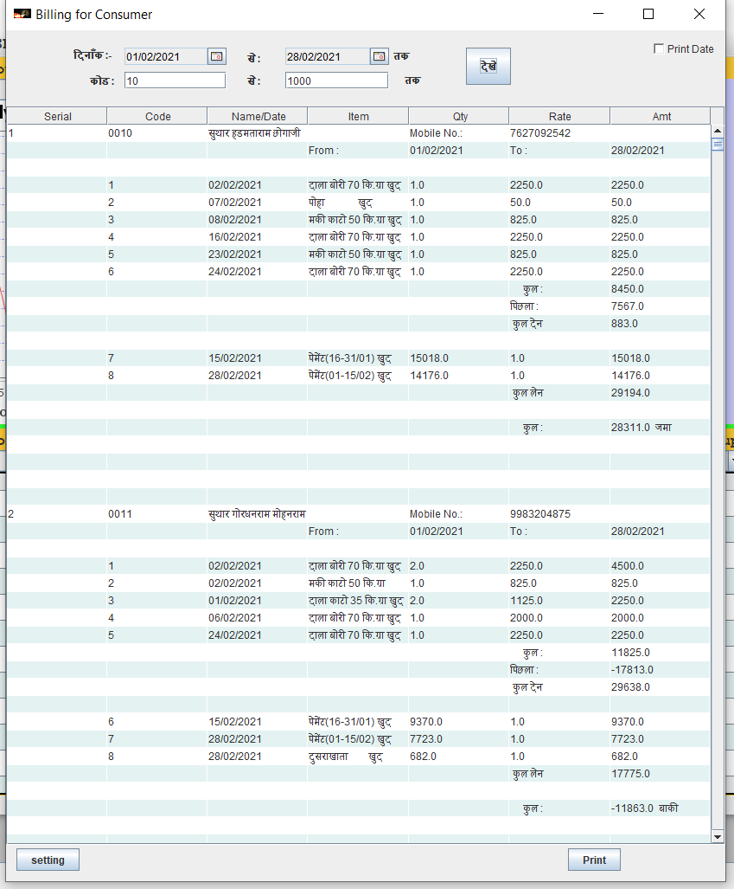 

 
<b>Bill can be printed in two forms.</b>
 

   *Without transaction date  
    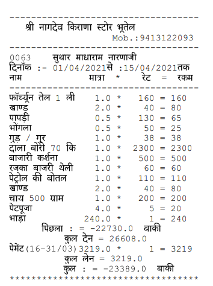 

   *If we want to print with date  
    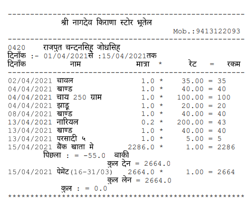 

<b>Consumer details</b>
 

    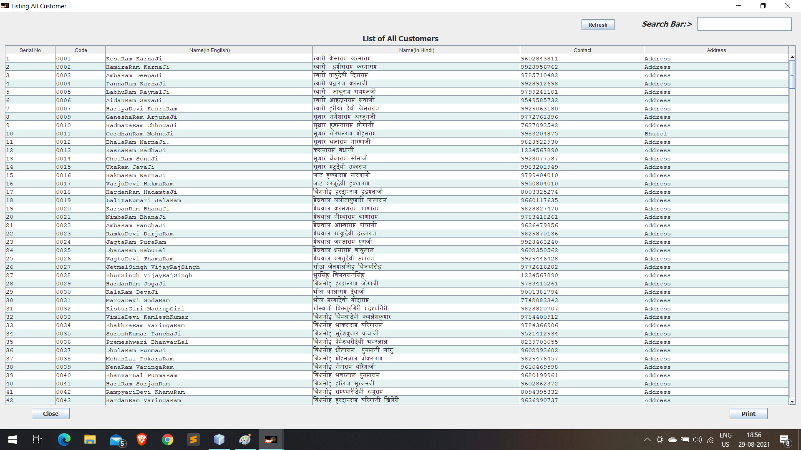 

<b>Item order book:</b>
 

    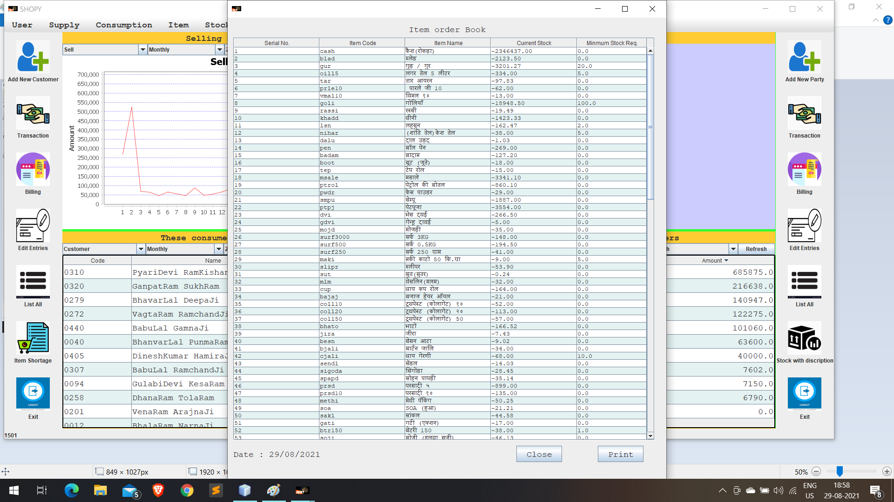 

<b>Items stock with description:</b>
 

    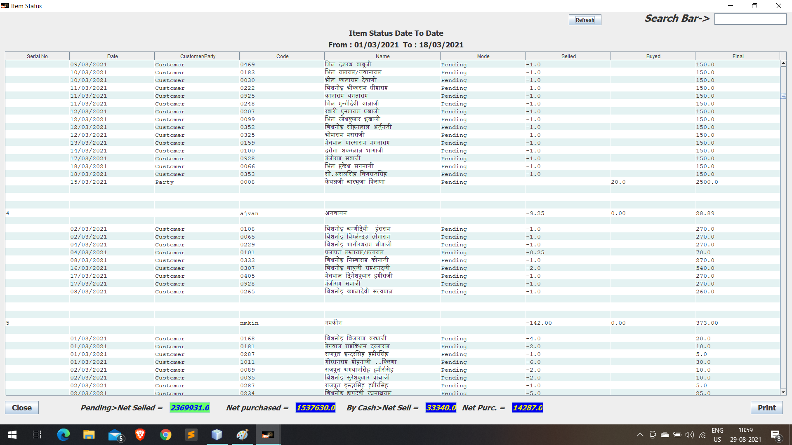 

# Progress Direction
    • Graphical analysis of demand and trade in product markets
    • SQL database
    • Role-based access control
         o Like employee and owner have difference level of access and modification
    • Remote database storage
    • Spring frame work
    • Pair with android application
    • Consumer order booking

## Implimentation

 I have implemented this application with swing GUI in Java frame work using java programming language. This is available for both English and Hindi language. I have spent little more then the expected as that time I was new to java and this is first ever project. So, the code is also kind of bulky but now, I am working on it to get rid of it again and use efficient algorithms to optimize it. I converting file system database to SQL database.

 # Some class diagrams
 
 <b> User : </b>
  
  Each shop has a unique id and password. It’s more less kind of Admin user.
  

      
     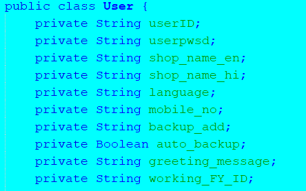 
  

 
 <b> Employee : </b>
  
  Like many shops have employee working in their shop. But security and confidential purpose we cannot give them the shop id with password. I am planning to provide role-based access of resources.
  

      
     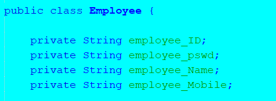 
  

 
 <b> Consumer class : </b>
  
  Every customer has a unique id (customer code). It is integer type (e.g., 0231). In this class we are storing consumer profile information as shown below. And customer id creates by user not automatically.
  

      
     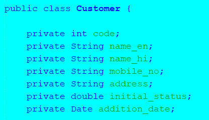 
  

 
 <b> Item class: </b>
  
  Similarly, each item(product) also has a unique id (item code). It is string type e.g., kaju900. As different diversity as there in single kind of product so some uniquely identifying thing should be added at end of timecode.
  

      
     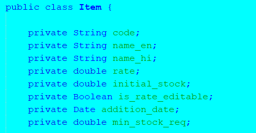 
  

 
  <b> Supplier class : </b>
  
  Every supplier has a unique id (supplier code). It is integer type (e.g., 0051). In this class we are storing Supplier profile information as shown below. And Supplier id creates by user not automatically.
  

      
     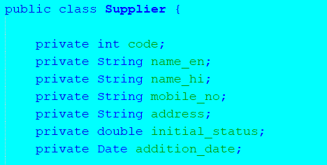 
  

 
 ## ER Diagrams
 
 <b>This is how my database looks likes</b>
 

      
     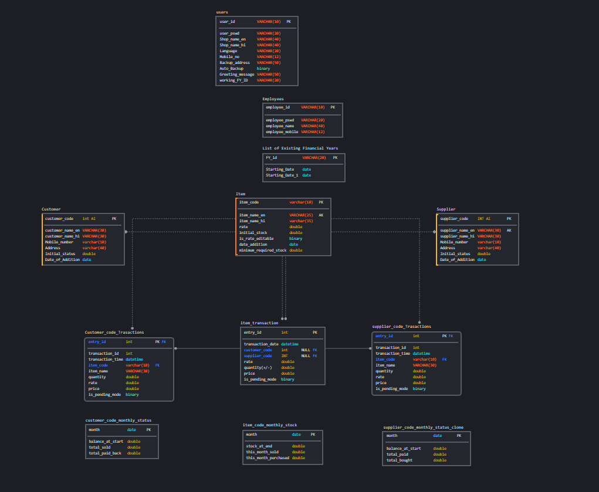 
  

 
  
 <b> Database for User(Shop Admin)</b>
 

      
     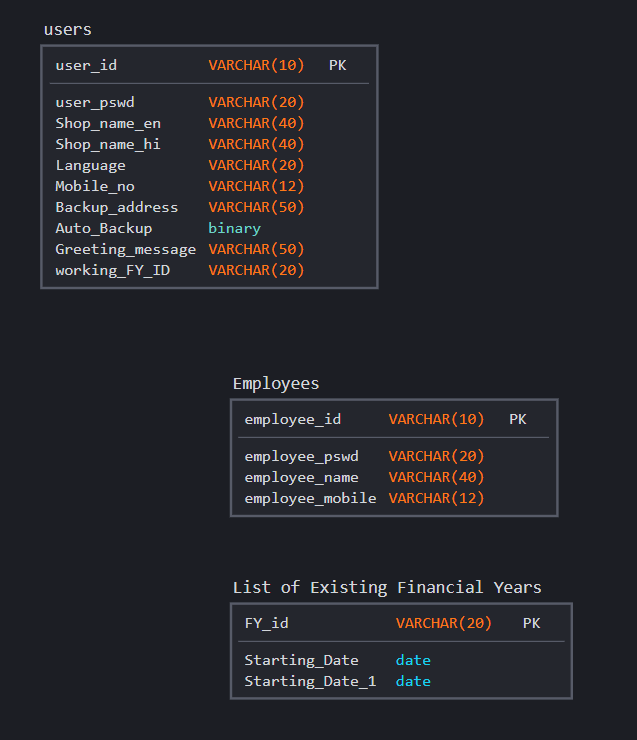 
  

 
  
 <b> Shop Transaction Database</b>  It includes the data for consumers, suppliers and products.
 

      
     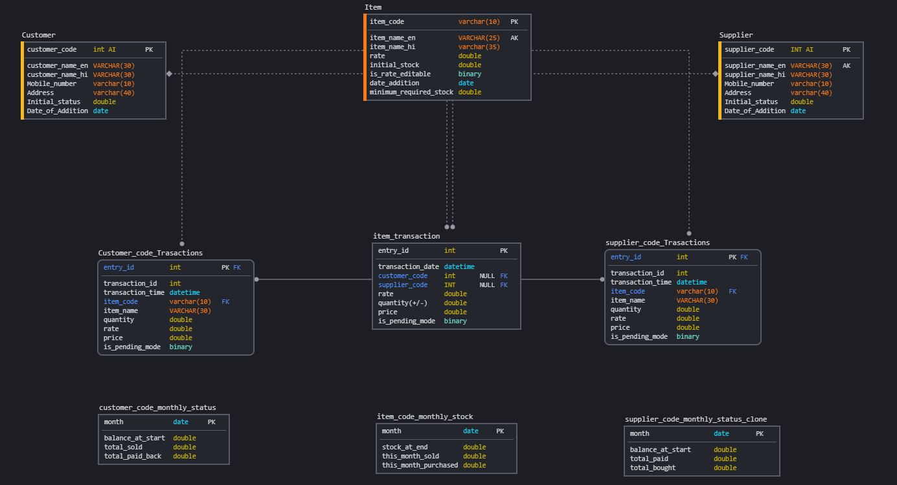 
  

